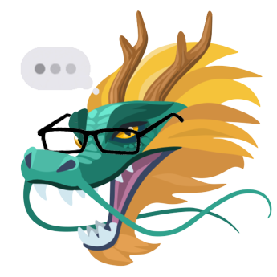

<div align='center'>
  </img>
</div>
<h1 align='center'>
  DMs and Dragons
</h1>

<p align='center'>A Facebook Messenger bot for creative, immersive and interactive storytelling in the age of online messaging.
</p>

## 🚀 Quick start with ngrok

1. **Download and setup [ngrok](https://ngrok.com/download).**

1. **Clone this repository and run yarn.**

    ```zsh
    $ git clone https://github.com/faishasj/dms-and-dragons-webhook
    $ cd dms-and-dragons-webhook
    $ yarn
    ```

1. **Setup your ngrok.yml and run ngrok**

    If you only need to tunnel the webhook, then run:

    ```zsh
    ./ngrok http <WEBHOOK_PORT>
    ```

    If you are tunneling both the webhook and the [webview](https://github.com/faishasj/dms-and-dragons-webview), then you need to add the following to your ngrok.yml:

    ```yml
    tunnels:
      first:
        addr: <WEBHOOK_PORT>
        proto: http  
      second:
        addr: <WEBVIEW_PORT>
        proto: http
    ```

    and run:

    ```zsh
    ./ngrok start --all
    ```

1. **If tunneling the webview, include its https domain as an environment variable for the webhook.**

    Only if you are tunneling the webview, copy the **https** domain for the webview and add it as an environment variable `DEV_WEBVIEW_URL` in .env.

    Make sure you also have the `GOOGLE_SERVICE_ACCOUNT` in your .env.

1. **Run the development server on localhost.**

    In a new terminal, run:

    ```zsh
    $ yarn setup:profile
    $ yarn start
    ```

    If you are also tunneling the webview, then you can start its development server as well in a new terminal:

    ```zsh
    $ yarn start
    ```

1. **Update the callback URL in the settings for the Facebook App.**

    Copy the **https** domain for the webhook, add `/webhook` at the end, and use it to modify the callback URL for your app on developers.facebook.com/apps under Products > Messenger > Settings > Webhooks. You will need your verify token for this.